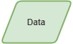
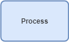
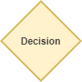

<h1>Flowchart</h1>

Flowchart atau diagram bagan alur adalah salah satu cara untuk merepresentasikan algoritma ke dalam bentuk yang terdiri dari kumpulan simbol-simbol.
Jika pada psuedocode menggunakan notasi yang mirip dengan bahasa pemrograman, pada flowchart kita menggunakan gambar simbol simbol untuk menjelaskan langkah-langkah 
pemecahan permasalahan.

Kenapa kamu perlu gunakan flowchart?
 
Jawabannya karena flowchart sangat mudah untuk dipahami baik oleh programmer atau pun orang bukan berasal dari dunia IT.

<h2>Simbol simbol pada flowchart</h2>
<h3>Terminator</h3>

   

Simbol ini digunakan di paling awal untuk memulai algoritma dan di paling akhir dari mengakhiri algoritma.

<h3>Data</h3>

   

Simbol ini digunakan untuk merepresentasikan data, dan digunakan untuk menjelaskan input atau output dan juga hasil akhir yang ada pada algoritma.

<h3>Proses</h3>

   

Simbol ini digunakan untuk merepresentasikan suatu proses atau aksi yang di lakukan.

<h3>Percabangan</h3>

   

Simbol ini digunakan untuk merepresentasikan suatu pertanyaan/percabangan. Simbol ini akan memisahkan alur dari algoritma menjadi dua buah bagian, salah satu bagian
akan dipilih berdasarkan terpenuhi atau tidaknya kondisi.

<h2>Contoh Representasi Algoritma Dalam Flowchart</h2>
Pada contoh ini kita akan merepresentasikan algoritma untuk menetukan apakah hasil dari penjumlahan 2 buah bilangan ganjil atau genap ke dalam flowchart

   

