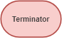

<h1>Flowchart</h1>

Flowchart atau diagram bagan alur adalah salah satu cara untuk merepresentasikan algoritma ke dalam bentuk yang terdiri dari kumpulan simbol-simbol.
Jika pada psuedocode menggunakan notasi yang mirip dengan bahasa pemrograman, pada flowchart kita menggunakan gambar simbol simbol untuk menjelaskan langkah-langkah 
pemecahan permasalahan.

Kenapa kamu perlu gunakan flowchart? 
Jawabannya karena flowchart sangat mudah untuk dipahami baik oleh programmer atau pun orang bukan berasal dari dunia IT.

<h2>Simbol simbol pada flowchart</h2>
<h3>Terminator</h3>

   

Simbol ini digunakan di paling awal untuk memulai algoritma dan di paling akhir dari mengakhiri algoritma
