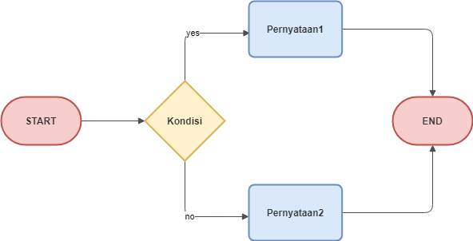

<h1>Pemilihan</h1>

Kadang di kehidupan sehari hari kita harus memilih satu dari beberapa pilihan, contoh: 

```
Ketika kita ingin pergi kerumah teman kita, ada banyak jalan yang bisa kita pilih untuk sampai ke sana, tetapi kita hanya memilih 
satu jalan saja dan kita pasti punya sebuah alasan kenapa memilih jalan itu misal karena jalan itu lebih dekat atau tidak macet.

Dengan memilih jalan yang benar kita dapat sampai ke rumah teman kita lebih cepat.
```

Dari kasus di atas dapat kita lihat kalau kemampuan memilih satu dari beberapa opsi itu sangat berguna dan tidak hanya di kehidupan sehari hari, namun juga di dalam
algoritma dan program.

<h2>Penulisan Struktur Pemilihan Pada Algoritma</h2>
Terdapat 2 buah perintah untuk pemilihan yang paling umum di dalam penulisan algoritma yaitu:
<h3>IF ELSE</h3>
<h4>IF ELSE Pada Psuedocode</h4>

```
IF (kondisi) THEN
  pernyataan1
ELSE
  pernyataan2
ENDIF
```

<h4>IF ELSE Pada Flowchart</h4>

<div>
   
<div>

Struktur IF ELSE baik pada psuedocode atau flowchart memiliki arti:

```
jika kondisi benar maka lakukan pernyataan1 
jika kondisi salah maka lakukan pernyataan2
```

<h3>SWITCH CASE</h3>
<h4>SWITCH CASE Pada Psuedocode</h4>

```
CASE(ekspresi)
  kondisi1: pernyataan1
  kondisi2: pernyataan2
  kondisi3: pernyataan3
  kondisi4: pernyataan4
  OTHERWISE pernyataan5
ENDCASE
```

<h4>SWITCH CASE Pada Flowchart</h4>

<div>
   
<div>

Struktur swicth case memiliki arti: 

```
jika ekspresi sama dengan kondisi1 maka lakukan pernyataan1, 
jika ternyata ekspresi tidak sama dengan kondisi1 tapi sama dengan kondisi2 maka lakukan pernyataan2 
apabila ekspresi tidak sama dengan semua kondisi maka lakukan pernyataan5
```

</br>
Contributor: <a href="https://www.instagram.com/yudhaanaa">Yudha Nawawi</a>
